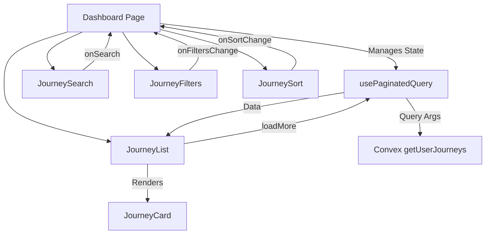

# Journey Dashboard Components

This directory contains all the components for the Journey Dashboard Interface, implementing a responsive and performant dashboard for users to view, search, filter, and sort their journeys.

## Components Overview

### 1. JourneyCard (`journey-card.tsx`)
A reusable card component that displays a single journey's summary.

**Features:**
- Displays journey title, description, and key stats
- Shows status badge (active/archived) and visibility indicator
- Responsive design with hover effects
- Clickable navigation to journey detail page
- Formatted distance and date display

**Props:**
- `journey`: Journey object with all necessary fields

### 2. JourneySearch (`journey-search.tsx`)
A search input component with debouncing functionality.

**Features:**
- Debounced search (300ms delay)
- Clear button when search term is present
- Customizable placeholder text
- Accessible with proper ARIA labels

**Props:**
- `onSearch`: Callback function for search term changes
- `initialSearchTerm`: Optional initial search value
- `placeholder`: Optional placeholder text

### 3. JourneyFilters (`journey-filters.tsx`)
A comprehensive filtering component with multiple filter types.

**Features:**
- Status filter (Active/Archived)
- Activity type filter (dynamic list)
- Date range filter with field selection (Created/Updated/Last Activity)
- Visual filter count badge
- Clear all filters functionality
- Responsive layout

**Props:**
- `onFiltersChange`: Callback for filter changes
- `currentFilters`: Current filter state
- `activityTypes`: Array of available activity types

### 4. JourneySort (`journey-sort.tsx`)
A sorting component with persistent preferences.

**Features:**
- Sort by: Created Date, Updated Date, Title, Distance
- Sort order toggle (ascending/descending)
- Persistent preferences using localStorage
- Visual sort direction indicators

**Props:**
- `onSortChange`: Callback for sort changes
- `currentSortBy`: Current sort field
- `currentSortOrder`: Current sort direction

### 5. JourneyList (`journey-list.tsx`)
The main list component with infinite scrolling and view modes.

**Features:**
- Grid and list view modes
- Infinite scrolling with Intersection Observer
- Loading states and skeletons
- Empty state with call-to-action
- Responsive grid layout
- View mode persistence

**Props:**
- `journeys`: Array of journey objects
- `loadMore`: Function to load more journeys
- `hasMore`: Boolean indicating if more data is available
- `isLoading`: Loading state for initial load
- `isLoadingMore`: Loading state for pagination

## State Management

The dashboard uses React hooks for state management:

```typescript
// Search state
const [searchTerm, setSearchTerm] = useState("");

// Filter state
const [filters, setFilters] = useState<FilterState>({});

// Sort state
const [sortBy, setSortBy] = useState("updatedAt");
const [sortOrder, setSortOrder] = useState<"asc" | "desc">("desc");
```

## Data Flow



## Backend Integration

The dashboard integrates with the Convex backend through:

- **Query**: `api.journeys.queries.getUserJourneys`
- **Pagination**: Uses `usePaginatedQuery` hook
- **Real-time**: Automatic updates when data changes

## Responsive Design

All components are built with responsive design principles:

- **Mobile First**: Components work on small screens
- **Breakpoints**: Uses Tailwind CSS responsive utilities
- **Flexible Layouts**: Grid and flexbox for adaptive layouts
- **Touch Friendly**: Appropriate touch targets for mobile

## Accessibility

Components follow accessibility best practices:

- **Semantic HTML**: Proper heading hierarchy and landmarks
- **ARIA Labels**: Screen reader support
- **Keyboard Navigation**: Full keyboard accessibility
- **Focus Management**: Visible focus indicators
- **Color Contrast**: Meets WCAG guidelines

## Performance Optimizations

- **Debounced Search**: Reduces API calls
- **Infinite Scrolling**: Loads data on demand
- **Memoized Callbacks**: Prevents unnecessary re-renders
- **Intersection Observer**: Efficient scroll detection
- **Local Storage**: Persists user preferences

## Usage Example

```tsx
import { 
  JourneySearch, 
  JourneyFilters, 
  JourneySort, 
  JourneyList,
  type FilterState 
} from "@/components/dashboard";

export default function DashboardPage() {
  const [searchTerm, setSearchTerm] = useState("");
  const [filters, setFilters] = useState<FilterState>({});
  const [sortBy, setSortBy] = useState("updatedAt");
  const [sortOrder, setSortOrder] = useState<"asc" | "desc">("desc");

  const { results, status, loadMore } = usePaginatedQuery(
    api.journeys.queries.getUserJourneys,
    {
      searchTerm: searchTerm || undefined,
      status: filters.status,
      defaultActivityType: filters.defaultActivityType,
      dateFilter: filters.dateFilter,
      sortBy,
      sortOrder,
      paginationOpts: { numItems: 12 },
    }
  );

  return (
    <div className="space-y-8">
      <JourneySearch onSearch={setSearchTerm} />
      <JourneyFilters 
        onFiltersChange={setFilters}
        currentFilters={filters}
        activityTypes={ACTIVITY_TYPES}
      />
      <JourneySort 
        onSortChange={(sortBy, sortOrder) => {
          setSortBy(sortBy);
          setSortOrder(sortOrder);
        }}
        currentSortBy={sortBy}
        currentSortOrder={sortOrder}
      />
      <JourneyList
        journeys={results || []}
        loadMore={() => loadMore(12)}
        hasMore={status === "CanLoadMore"}
        isLoading={status === "LoadingFirstPage"}
        isLoadingMore={status === "LoadingMore"}
      />
    </div>
  );
}
```

## Future Enhancements

Potential improvements for the dashboard:

1. **Advanced Filters**: Distance range, elevation gain filters
2. **Bulk Operations**: Select multiple journeys for bulk actions
3. **Export Options**: Export filtered results
4. **Saved Searches**: Save and recall filter combinations
5. **Analytics**: Journey statistics and insights
6. **Map View**: Alternative map-based view of journeys