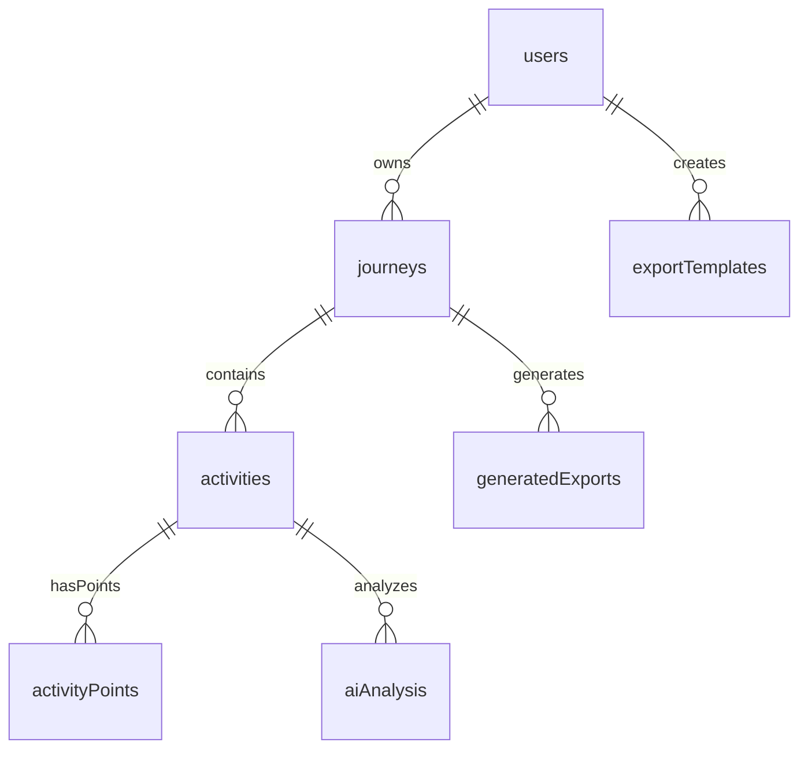

# ReShare Phase 1 MVP Implementation Plan

## Project Overview

**ReShare** is a comprehensive web application for capturing, customizing, and sharing real-world journeys as visually engaging images and interactive experiences. This implementation plan covers the complete Phase 1 MVP Foundation with realistic timelines, dependencies, and technical specifications.

## Current Project State Analysis

### ✅ Already Implemented
- **Next.js 15.3.3** with App Router and React 19
- **TypeScript 5.8.3** with strict configuration
- **Tailwind CSS 4.1.8** with modern design system
- **Convex 1.24.3** backend integration with basic auth config
- **Clerk v5/v6** authentication setup
- **Shadcn UI** component library with Radix UI primitives
- **Development tooling**: Biome, Husky, lint-staged
- **Environment configuration** with @t3-oss/env-nextjs
- **Basic project structure** with providers and routing

### 📋 Reference Assets Available
- **Complete Convex backend schema** with all tables and relationships
- **Comprehensive utility functions** for GPX processing, calculations
- **Database design** optimized for performance and scalability
- **Authentication patterns** and user management flows

## Phase 1 Implementation Roadmap

### 🎯 Sprint 1: Foundation & Infrastructure (Week 1-2)
**Duration**: 2 weeks | **Priority**: Critical | **Dependencies**: None

#### 1.1 Complete Development Environment Setup
**Estimated Time**: 3-4 days

**Tasks:**
- [x] **Environment Variables Configuration**
  - Create comprehensive `.env.local` template
  - Set up development, staging, production configurations
  - Configure Convex deployment environments
  - Add Clerk authentication keys
  - Document all required environment variables


- [x] **Code Quality & CI/CD**
  - Enhance Biome configuration for stricter linting
  - Set up GitHub Actions workflows
  - Configure automated testing pipelines
  - Add code coverage reporting
  - Set up automated dependency updates

**Deliverables:**
- Complete development environment documentation
- Automated testing pipeline
- Code quality gates
- Environment configuration templates

#### 1.2 Backend Infrastructure Implementation
**Estimated Time**: 4-5 days

**Tasks:**
- [x] **Convex Schema Implementation**
  - [x] Implement complete database schema from reference
  - [x] Set up all tables: users, journeys, activities, exports, etc.
  - [x] Configure indexes for optimal query performance
  - [x] Add data validation with Zod schemas
  - [x] Set up database migrations system

- [x] **Authentication Integration**
  - [x] Complete Clerk integration with Convex
  - [x] Implement user profile management
  - [x] Set up protected routes middleware
  - [x] Configure session management
  - [x] Add user onboarding flows

- [ ] **Core Utility Functions**
  - [ ] Implement GPX processing utilities
  - [ ] Add geospatial calculation functions
  - [ ] Create route simplification algorithms
  - [ ] Set up error handling and logging
  - [ ] Add performance monitoring

**Deliverables:**
- Fully functional backend with all schemas
- Authentication system with user management
- Core utility functions library
- Database with proper indexing

#### 1.3 Deployment & Monitoring Setup
**Estimated Time**: 2-3 days

**Tasks:**
- [ ] **Vercel Deployment Configuration**
  - Connect GitHub repository to Vercel
  - Configure automatic deployments
  - Set up preview deployments for PRs
  - Configure custom domain
  - Add environment variables in Vercel dashboard

- [ ] **Monitoring & Analytics**
  - Integrate Sentry for error tracking
  - Set up performance monitoring
  - Configure uptime monitoring
  - Add user analytics (privacy-compliant)
  - Set up logging and alerting

**Deliverables:**
- Production deployment pipeline
- Monitoring and alerting system
- Performance tracking dashboard

---

### 🔐 Sprint 2: Authentication & User Management (Week 3)
**Duration**: 1 week | **Priority**: Critical | **Dependencies**: Sprint 1

#### 2.1 Complete Authentication System
**Estimated Time**: 3-4 days

**Tasks:**
- [ ] **Authentication Pages & Flows**
  - Implement sign-in/sign-up pages with Clerk components
  - Add social login options (Google, GitHub)
  - Create password reset functionality
  - Style authentication forms with Tailwind
  - Add loading states and error handling

- [ ] **Protected Routes & Middleware**
  - Create authentication middleware for app router
  - Implement route guards for protected pages
  - Add redirect logic for unauthenticated users
  - Handle authentication state changes
  - Create loading states for auth checks

- [ ] **User Profile Management**
  - Build user profile page with editable fields
  - Implement profile image upload
  - Add user preferences and settings
  - Create account deletion workflow
  - Add data export functionality (GDPR)

**Deliverables:**
- Complete authentication system
- User profile management interface
- Protected route system

#### 2.2 User Onboarding Experience
**Estimated Time**: 2-3 days

**Tasks:**
- [ ] **Welcome & Onboarding Flow**
  - Design welcome screen with app overview
  - Create progressive profile setup wizard
  - Implement interactive feature tour
  - Add skip options for experienced users
  - Track onboarding completion analytics

- [ ] **First Journey Setup Guide**
  - Create guided first journey creation
  - Provide sample GPX files for testing
  - Add contextual help and tooltips
  - Create demo journey with example data
  - Implement contextual help system

**Deliverables:**
- User onboarding flow
- Interactive feature tour
- Sample data and tutorials

---

### 🗺️ Sprint 3: Journey Management Core (Week 4-5)
**Duration**: 2 weeks | **Priority**: Critical | **Dependencies**: Sprint 2

#### 3.1 Journey CRUD Operations
**Estimated Time**: 5-6 days

**Tasks:**
- [x] **Journey Database Implementation**
  - Implement Convex queries for journey operations
  - Create journey mutations (create, update, delete)
  - Add journey validation with Zod schemas
  - Set up journey-user relationships
  - Implement journey sharing permissions

- [x] **Journey Dashboard Interface**
  - Build responsive journey grid/list with cards
  - Implement infinite scroll for performance
  - Add search functionality with debounced queries
  - Create filter options (date, type, status)
  - Add sorting with persistent preferences

- [ ] **Journey Creation & Editing**
  - Build journey creation modal/page
  - Implement form validation with React Hook Form
  - Add cover image upload with preview
  - Create journey settings configuration
  - Implement auto-save functionality

**Deliverables:**
- Complete journey CRUD system
- Journey dashboard interface
- Journey creation and editing forms

#### 3.2 Journey Detail & Management
**Estimated Time**: 3-4 days

**Tasks:**
- [ ] **Journey Detail View**
  - Create comprehensive journey overview page
  - Display journey statistics and metadata
  - Show activity count and total distance
  - Add journey sharing options
  - Implement journey export functionality

- [ ] **Advanced Journey Features**
  - Implement journey duplication
  - Create archiving system with separate view
  - Add bulk operations for multiple journeys
  - Create journey deletion with confirmation
  - Add journey templates system

**Deliverables:**
- Journey detail pages
- Advanced journey management features
- Journey templates system

---

### 📁 Sprint 4: GPX Processing Pipeline (Week 6-7)
**Duration**: 2 weeks | **Priority**: Critical | **Dependencies**: Sprint 3

#### 4.1 File Upload & Basic Processing
**Estimated Time**: 4-5 days

**Tasks:**
- [ ] **File Upload Interface**
  - Create drag-and-drop upload zone
  - Implement multiple file selection
  - Add file type validation (GPX, TCX, KML)
  - Create upload progress indicators
  - Implement upload cancellation

- [ ] **Client-side GPX Processing**
  - Set up Web Workers for background processing
  - Integrate @tmcw/togeojson library
  - Create GPX validation and error handling
  - Add basic route preprocessing
  - Implement progress reporting to main thread

- [ ] **File Storage System**
  - Implement Convex file storage integration
  - Add file compression before storage
  - Create file deduplication logic
  - Add file metadata extraction
  - Implement cleanup for failed uploads

**Deliverables:**
- File upload interface with validation
- Client-side GPX processing system
- File storage and management

#### 4.2 Advanced GPX Processing & Analysis
**Estimated Time**: 4-5 days

**Tasks:**
- [ ] **Server-side Processing Pipeline**
  - Create Convex functions for heavy GPX processing
  - Implement route simplification using algorithms
  - Add elevation data extraction and smoothing
  - Create activity statistics calculation
  - Implement batch processing for multiple files

- [ ] **Activity Auto-categorization**
  - Implement activity type detection from patterns
  - Create speed and elevation analysis algorithms
  - Add geographical analysis for classification
  - Create manual override functionality
  - Add confidence scoring for categorization

- [ ] **Data Quality Enhancement**
  - Implement GPS noise filtering
  - Add route gap detection and handling
  - Create outlier point detection and removal
  - Implement route smoothing algorithms
  - Add data quality scoring system

**Deliverables:**
- Advanced GPX processing pipeline
- Activity auto-categorization system
- Data quality enhancement tools

---

### 🗺️ Sprint 5: Interactive Map System (Week 8-9)
**Duration**: 2 weeks | **Priority**: High | **Dependencies**: Sprint 4

#### 5.1 Basic Map Implementation
**Estimated Time**: 5-6 days

**Tasks:**
- [ ] **MapLibre GL JS Integration**
  - Install and configure MapLibre GL JS 4.x
  - Create custom React wrapper components
  - Set up responsive map container
  - Implement basic map controls (zoom, pan, rotate)
  - Add map loading states and error handling

- [ ] **Free Map Tile Integration**
  - Set up OpenStreetMap tile servers
  - Implement multiple tile server fallbacks
  - Create tile caching strategy
  - Add tile loading error handling
  - Configure tile attribution requirements

- [ ] **Route Rendering System**
  - Implement GeoJSON route rendering
  - Create vector tile optimization
  - Add route color coding system
  - Implement level-of-detail rendering
  - Create route clustering for large datasets

**Deliverables:**
- Interactive map with OpenStreetMap tiles
- Route rendering system
- Map controls and interactions

#### 5.2 Advanced Map Features
**Estimated Time**: 3-4 days

**Tasks:**
- [ ] **Map Style System**
  - Implement multiple map styles (Light, Dark, Outdoors)
  - Create style switching functionality
  - Add user style preferences
  - Create color-blind friendly palettes
  - Implement custom style editor interface

- [ ] **Route Interaction System**
  - Implement route highlighting on hover/click
  - Create smooth fly-to animations
  - Add route selection and multi-select
  - Implement route information popups
  - Create route comparison mode

**Deliverables:**
- Multiple map styles
- Advanced route interactions
- Route comparison features

---

### 📊 Sprint 6: Activity Management (Week 10)
**Duration**: 1 week | **Priority**: High | **Dependencies**: Sprint 5

#### 6.1 Activity List & Organization
**Estimated Time**: 3-4 days

**Tasks:**
- [ ] **Activity List Interface**
  - Create scrollable activity list with virtual scrolling
  - Implement activity thumbnail generation
  - Add activity metadata display
  - Create activity sorting and filtering
  - Implement activity search functionality

- [ ] **Activity Detail View**
  - Create expandable activity detail panels
  - Display comprehensive activity statistics
  - Add interactive elevation profile charts
  - Create activity photo integration
  - Implement activity notes and descriptions

**Deliverables:**
- Activity list interface
- Activity detail views
- Activity organization features

#### 6.2 Activity Editing Features
**Estimated Time**: 2-3 days

**Tasks:**
- [ ] **Basic Activity Editing**
  - Implement inline activity name editing
  - Create activity type selection dropdown
  - Add custom color assignment for routes
  - Implement activity date/time editing
  - Create activity description editor

**Deliverables:**
- Activity editing interface
- Activity customization options

---

### 🖼️ Sprint 7: Static Image Generation (Week 11-12)
**Duration**: 2 weeks | **Priority**: High | **Dependencies**: Sprint 6

#### 7.1 Basic Image Export System
**Estimated Time**: 5-6 days

**Tasks:**
- [ ] **Server-side Rendering Setup**
  - Set up Canvas-based image generation
  - Implement multiple image format support (PNG, JPEG, WebP)
  - Add multiple DPI options (72, 150, 300 DPI)
  - Create image compression and optimization
  - Set up MapLibre GL for server-side rendering

- [ ] **Image Customization Interface**
  - Create image size and aspect ratio selection
  - Implement basic text overlay functionality
  - Add logo/watermark placement options
  - Create color scheme customization
  - Implement map style selection for exports

**Deliverables:**
- Server-side image generation system
- Basic image customization interface

#### 7.2 Advanced Canvas Editor
**Estimated Time**: 4-5 days

**Tasks:**
- [ ] **Konva.js Canvas Editor Setup**
  - Install and configure Konva.js for React
  - Create canvas editor component architecture
  - Implement layer management system
  - Add undo/redo functionality
  - Create element selection and manipulation tools

- [ ] **Design Elements & Templates**
  - Implement text element creation and editing
  - Add shape drawing tools
  - Create image overlay functionality
  - Create predefined template layouts
  - Implement template saving and loading

**Deliverables:**
- Advanced canvas editor
- Template system
- Design elements library

---

### 🎨 Sprint 8: UI/UX & Polish (Week 13-14)
**Duration**: 2 weeks | **Priority**: Medium | **Dependencies**: Sprint 7

#### 8.1 Responsive Design & Mobile Optimization
**Estimated Time**: 4-5 days

**Tasks:**
- [ ] **Mobile-First Design System**
  - Optimize all components for mobile devices
  - Implement touch-optimized map interactions
  - Create mobile-first navigation system
  - Add gesture support for mobile devices
  - Implement Progressive Web App features

- [ ] **Desktop Experience Enhancement**
  - Create keyboard shortcuts for power users
  - Implement drag-and-drop functionality
  - Add context menus and hover states
  - Create multi-panel layout optimization
  - Implement window resize handling

**Deliverables:**
- Fully responsive design system
- Mobile-optimized interface
- Desktop power user features

#### 8.2 Animation & Accessibility
**Estimated Time**: 3-4 days

**Tasks:**
- [ ] **Animation & Transitions**
  - Install and configure Framer Motion
  - Create smooth page transitions
  - Implement micro-interactions
  - Add loading animations and skeletons
  - Create delightful hover and click animations

- [ ] **Accessibility Implementation**
  - Implement WCAG 2.1 AA compliance
  - Add keyboard navigation support
  - Create screen reader friendly content
  - Implement high contrast mode
  - Add focus management and aria labels

**Deliverables:**
- Polished animations and transitions
- WCAG 2.1 AA compliant interface
- Accessibility features

---

## Technical Architecture

### Frontend Stack
```typescript
// Core Framework
Next.js 15.3.3 (App Router)
React 19.1.0
TypeScript 5.8.3

// Styling & UI
Tailwind CSS 4.1.8
Shadcn UI + Radix UI
Framer Motion (animations)

// State Management
Convex React hooks
React Hook Form + Zod

// Map & Visualization
MapLibre GL JS 4.x
Konva.js (canvas editor)
Recharts (data visualization)

// File Processing
@tmcw/togeojson
Web Workers API
```

### Backend Stack
```typescript
// Backend as a Service
Convex 1.24.3

// Authentication
Clerk v5/v6

// File Storage
Convex File Storage

// Data Processing
Server-side Convex functions
Background job processing
```

### Development Tools
```typescript
// Code Quality
Biome (linting & formatting)
TypeScript strict mode
Husky + lint-staged

// Deployment
Vercel (hosting)
GitHub Actions (CI/CD)
```

## Database Schema Overview

### Core Tables
- **users**: User profiles and preferences
- **journeys**: Journey containers with metadata
- **activities**: Individual GPX activities
- **activityPoints**: Detailed route coordinates
- **exportTemplates**: Custom export templates
- **generatedExports**: Export history and files
- **aiAnalysis**: AI-powered route analysis
- **userSessions**: Active editing sessions
- **systemLogs**: Application monitoring

### Key Relationships


## Performance Considerations

### Frontend Optimization
- **Code Splitting**: Lazy load components and routes
- **Image Optimization**: Next.js Image component with WebP
- **Virtual Scrolling**: Handle large activity lists
- **Web Workers**: Background GPX processing
- **Service Worker**: Offline functionality and caching

### Backend Optimization
- **Database Indexing**: Optimized queries for large datasets
- **File Compression**: Reduce storage costs
- **Background Jobs**: Async processing for heavy operations
- **Caching Strategy**: Redis-like caching with Convex
- **Rate Limiting**: Protect against abuse

## Security Implementation

### Authentication & Authorization
- **Clerk Integration**: Secure user authentication
- **JWT Tokens**: Stateless session management
- **Role-based Access**: User permissions system
- **API Security**: Protected Convex functions

### Data Protection
- **Input Validation**: Zod schemas for all inputs
- **File Upload Security**: Type validation and size limits
- **GDPR Compliance**: Data export and deletion
- **Privacy Controls**: User data visibility settings


## Deployment Strategy

### Environment Setup
```bash
# Development
npm run dev

# Staging
vercel --env staging

# Production
vercel --prod
```

### CI/CD Pipeline
1. **Code Push**: GitHub repository
2. **Automated Testing**: Unit and integration tests
3. **Build Process**: Next.js build and optimization
4. **Deployment**: Vercel automatic deployment
5. **Monitoring**: Sentry error tracking

## Risk Mitigation

### Technical Risks
- **MapLibre Performance**: Implement progressive loading
- **Large File Processing**: Use Web Workers and chunking
- **Mobile Performance**: Optimize for low-end devices
- **Browser Compatibility**: Progressive enhancement

### Timeline Risks
- **Scope Creep**: Strict feature prioritization
- **Technical Debt**: Regular refactoring sprints
- **Integration Issues**: Early integration testing
- **Performance Issues**: Continuous performance monitoring

## Success Metrics

### Technical Metrics
- **Core Web Vitals**: LCP < 2.5s, FID < 100ms, CLS < 0.1
- **Test Coverage**: > 80% unit test coverage
- **Error Rate**: < 1% error rate in production
- **Uptime**: > 99.9% availability

### User Experience Metrics
- **Time to First Journey**: < 5 minutes from signup
- **GPX Processing Speed**: < 30 seconds for typical files
- **Mobile Performance**: Smooth 60fps interactions
- **Accessibility Score**: WCAG 2.1 AA compliance

## Phase 1 Deliverables Summary

### Week 1-2: Foundation
- ✅ Complete development environment
- ✅ Backend infrastructure with Convex
- ✅ Deployment pipeline

### Week 3: Authentication
- ✅ User authentication system
- ✅ User onboarding flow

### Week 4-5: Journey Management
- ✅ Journey CRUD operations
- ✅ Journey dashboard and details

### Week 6-7: GPX Processing
- ✅ File upload and processing
- ✅ Advanced GPX analysis

### Week 8-9: Interactive Maps
- ✅ MapLibre integration
- ✅ Route rendering and interactions

### Week 10: Activity Management
- ✅ Activity list and organization
- ✅ Activity editing features

### Week 11-12: Image Generation
- ✅ Static image export system
- ✅ Canvas editor with templates

### Week 13-14: UI/UX Polish
- ✅ Responsive design optimization
- ✅ Accessibility and animations

## Next Steps After Phase 1

### Phase 2 Preparation
- **AI Integration**: Route analysis and recommendations
- **Social Features**: Journey sharing and community
- **Advanced Editing**: Route modification tools
- **Mobile App**: React Native implementation

### Continuous Improvement
- **Performance Optimization**: Based on real user data
- **Feature Enhancements**: User feedback integration
- **Scalability Planning**: Infrastructure scaling
- **Security Audits**: Regular security assessments

---

**Total Estimated Timeline**: 14 weeks (3.5 months)
**Team Size**: 2-3 developers (1 full-stack lead + 1-2 developers)
**Budget Considerations**: Convex, Clerk, Vercel costs scale with usage

This implementation plan provides a comprehensive roadmap for building the ReShare MVP with realistic timelines, clear dependencies, and detailed technical specifications. The modular approach allows for parallel development and iterative delivery of features.